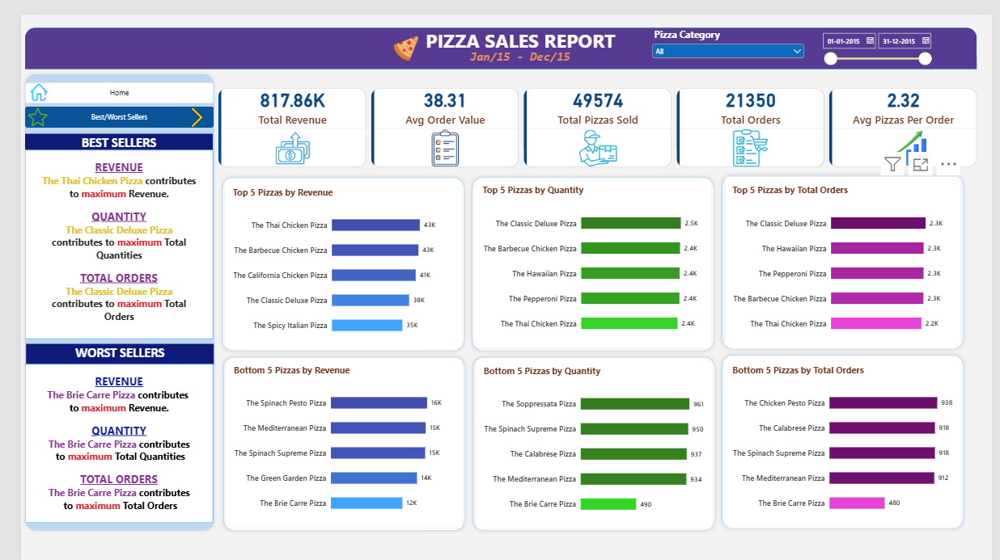
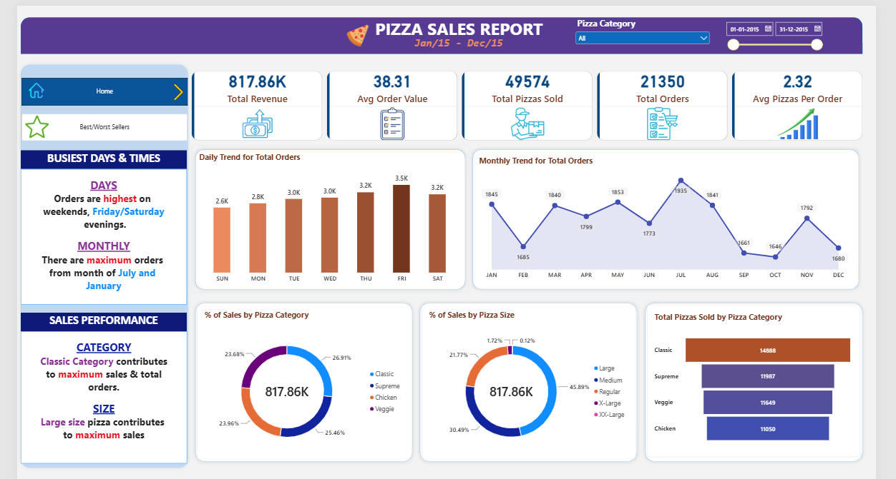

# 🍕 Pizza Sales Analysis | SQL & Power BI

## 📌 Project Overview

This project analyzes pizza sales data using PostgreSQL, SQL and Microsoft Power BI.

The objective was to analyze sales performance, ordering patterns, pizza categories, pizza sizes, and individual pizza performance and present the findings through an interactive Power BI dashboard.

## 🛠️ Tools Used

- PostgreSQL
- Microsoft Power BI
- Microsoft Excel

## 🔍 SQL Analysis

The project includes SQL analysis for:

- Total Revenue
- Average Order Value
- Total Pizzas Sold
- Total Orders
- Average Pizzas per Order
- Daily Order Trends
- Monthly Order Trends
- Sales by Pizza Category
- Sales by Pizza Size
- Total Pizzas Sold by Category
- Top 5 Pizzas by Revenue
- Bottom 5 Pizzas by Revenue
- Top 5 Pizzas by Quantity
- Bottom 5 Pizzas by Quantity
- Top 5 Pizzas by Total Orders
- Bottom 5 Pizzas by Total Orders

## 📊 Power BI Dashboard

The dashboard includes:

- Total Revenue
- Average Order Value
- Total Pizzas Sold
- Total Orders
- Average Pizzas per Order
- Daily and Monthly Order Trends
- Sales by Pizza Category
- Sales by Pizza Size
- Top and Bottom Performing Pizzas

## 📷 Dashboard Preview

### Best & Worst Sellers



### Sales Performance



## 📚 Key Learnings

- Learned how to use PostgreSQL for data analysis and SQL queries.
- Practiced aggregations, filtering, grouping, sorting, and subqueries.
- Learned how to calculate business KPIs such as Total Revenue and Average Order Value.
- Learned how to connect and analyze data in Microsoft Power BI.
- Created interactive dashboards using charts, cards, slicers, and navigators.
- Improved skills in presenting sales insights through data visualization.

## 📁 Project Structure

```text
pizza-sales-analysis/
│
├── SQL/
│   └── Pizza_Sales_Queries.sql
│
├── Data/
│   └── pizza_sales.xlsx
│
├── Dashboard/
│   ├── Best_Worst_Sellers.png
│   ├── Sales_Performance.png
│   └── Pizza_Sales_Dashboard.pdf
│
└── README.md


